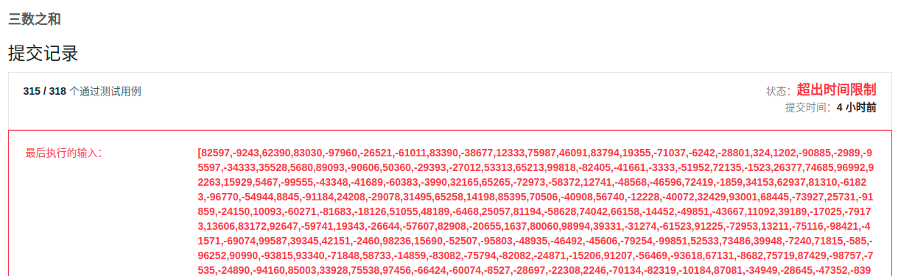

## 前言

题目：[15. 三数之和](https://leetcode-cn.com/problems/3sum/)

参考答案：[三数之和-力扣官方题解](https://leetcode-cn.com/problems/3sum/solution/san-shu-zhi-he-by-leetcode-solution/)

---

## 提交代码

### 哈希表

因为之前做过[leetcode 1 两数之和](https://blog.csdn.net/sinat_38816924/article/details/119982105)。所以，自然思考能否在三数之和上，套用上面的思路。

方法一：三数之和，三层循环暴力解的时间复杂度为$O(n^3)$。

方法二：将其中两数之和暴力计算，放入hash表中。使用另一个数字来查找，时间复杂度降到$O(n^2)$。大体逻辑上行得通，我们再来看看细节。我们需要用map来存储两数之和，键值对为`<twosum,val1,val2>`。因为可能不同val组合的sum值是相同的，所以我们采用`multimap`。不需要顺序，进而采用`unordered_multimap`。另外，我们需要区别`[-1,2]`和`[-1,-1,2]`,所以我们的键值对存储修改为`<twosum,index1,index2>`。

方法的数据存储没有问题之后，我们需要考虑去重问题。使用方法二，同一组下标组合，存在三次重复。我们将下标排序，使用set轻松去重。

欧凯，整体思路没问题，我们来敲代码。

```c++
class Solution {
public:
    vector<vector<int>> threeSum(vector<int>& nums) {
        const int len = nums.size();
        vector<vector<int>> result;
        // unordered_set<vector<int>> resultSet; // unordered_set默认没有对vector的hash方法
        set<vector<int>> resultSet;

        if(len<3){ // 不足三个元素，直接返回
            return result;
        }
        
        unordered_multimap<int, pair<int,int>> twoNums; // 存储两数之和，键值对为<两数之和，<数1下标，数2下标>>
        for(int i=0; i<len; i++){
            for(int j=i+1; j<len; j++)
                twoNums.insert({nums[i]+nums[j],{i,j}});
        }

        for(int i=0; i<len; i++){  // 将和为零的下标三元组排序之后，放入set，以去重
            int needNum = -nums[i];
            auto n = twoNums.count(needNum);
            if(n==1){
                auto it = twoNums.find(needNum);
                if(i!=it->second.first && i!=it->second.second){ // 避免自身重复
                    vector<int> oneAnsLoc = {i,it->second.first,it->second.second};
                    sort(oneAnsLoc.begin(),oneAnsLoc.end());
                    resultSet.insert(oneAnsLoc);
                }
            }else if(n>1){
                auto pr = twoNums.equal_range(needNum);
                while(pr.first != pr.second){
                    if(i!=pr.first->second.first && i!=pr.first->second.second){
                        vector<int> oneAnsLoc = {i,pr.first->second.first,pr.first->second.second};
                        sort(oneAnsLoc.begin(),oneAnsLoc.end());
                        resultSet.insert(oneAnsLoc);
                    }
                    pr.first++;
                }
            }
        }

        // resultSet中存储的是下标不重复的组合，下面在进行元素不重复
        set<vector<int>> real_resultSet;
        for(auto oneAnsLoc : resultSet){ // 将set中的内容拷贝到vector中
            vector<int> oneAns;
            for(auto i : oneAnsLoc)
                oneAns.push_back(nums[i]);
            sort(oneAns.begin(),oneAns.end());
            real_resultSet.insert(oneAns);
        }

        // 将元素和为零的组合，复制到vector中
        for(auto oneAns : real_resultSet){
            result.push_back(oneAns);
        }
        return result;
    }
};
```

尴尬的是，思路没bug，但超时了。

 

<br>

### 双指针

这里不用文字描述思路，直接看代码。结构清晰明了。

```c++
class Solution {
public:
    vector<vector<int>> threeSum(vector<int>& nums) {
        vector<vector<int>> result;
        const int len = nums.size();

        if(len < 3){ // 不足三个元素，直接返回
            return result;
        }

        sort(nums.begin(),nums.end()); // 升序排序，便于去重和求和

        for(int i=0; i<len; i++){
            if(nums[i]>0) // 三个数中第一个数大于零，则不存在
                break;
            
            if(i>0 && nums[i]==nums[i-1]) // 如果组合中的第一个数之前取过，去重不取
                continue;
            
            int left = i+1; 
            int right = len-1;
            int needNum = -nums[i];
            while(left < right){  // [left,right]闭区间中有不同的解，较大+较小，偏大+偏小
                if(nums[left]+nums[right] == needNum){
                    result.push_back({nums[i],nums[left],nums[right]});
                    left++;
                    right--; // 分别前往下一个位置
                    while(left < right && nums[left] == nums[left-1]) left++; // 下一个要取的数，之前的不能取过
                    while(left < right && nums[right] == nums[right+1]) right--; // 下一个要取的数，之前的不能取过
                }else if(nums[left]+nums[right] > needNum)
                    right--;
                else
                    left++;
            }
        }

        return result;
    }
};
```

