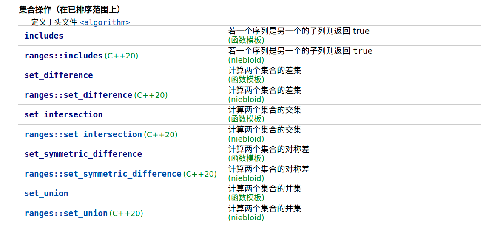

## 前言

题目：[349. 两个数组的交集](https://leetcode-cn.com/problems/intersection-of-two-arrays/)

参考答案：[349. 两个数组的交集-力扣官方题解](https://leetcode-cn.com/problems/intersection-of-two-arrays/solution/liang-ge-shu-zu-de-jiao-ji-by-leetcode-solution/)

---

## 提交代码

计算两个数组中元素的交集。从高中数学的角度出发，将两个数组放入两个集合，集合求交。

C++的STL提供了`unordered_set`和`set`这两种集合，即有序与无序集合。这道题目用这两者中的任意一种都挺合适。

### 无序集合

因为只需要集合求交，不需要顺序，所以使用无序集合合理。

思路：遍历一个集合中的元素到另一个集合中查找。若找到，则它是交集元素之一。由于无序集合采用hash表的底层数据结构。所以本代码的时间复杂度为$O(m+n)$。

```c++
#include <unordered_set>
#include <algorithm>
#include <iostream>
#include <vector>

using namespace std;

class Solution {
public:
    vector<int> intersection(vector<int>& nums1, vector<int>& nums2) {
        unordered_set<int> set1(nums1.begin(),nums1.end());
        unordered_set<int> set2(nums2.begin(),nums2.end());

        vector<int> result;
        for(auto num : set1){
            if(set2.count(num))
                result.push_back(num);
        }

        return result;
    }
};

int main(void){
    vector<int> nums1 = {4,9,5};
    vector<int> nums2 = {9,4,9,8,4};

    Solution s;
    
    vector<int> result = s.intersection(nums1,nums2);

    for(auto num : result)
        cout<<num<<" ";
}
```

### 有序集合

有序集合采用红黑树来实现。搜索、移除和插入拥有对数复杂度。建立集合的有序过程的时间复杂度为$O(mlogm+nlogn)$。使用上面的方式，遍历集合A中的元素到集合B中去查找，查找过程的时间复杂度为$O(mlogn)$。

有效率更高的办法，即利用有序。算法库中提供了有序范围求交的函数[std::set_intersection](https://zh.cppreference.com/w/cpp/algorithm/set_intersection)。`set_intersection`使用双指针的方式遍历求交集，求交过程的时间复杂度为$O(m+n)$。（所以这一题，可以使用sort排序之后，直接使用set_intersection进行求交，而不使用set）

```c++
class Solution {
public:
    vector<int> intersection(vector<int>& nums1, vector<int>& nums2) {
        set<int> set1(nums1.begin(),nums1.end());
        set<int> set2(nums2.begin(),nums2.end());

        vector<int> result;
        // back_inserter返回一个back_insert_iterator。它重载的赋值(=)运算符。当对其调用赋值运算符的时候，调用容器的push_bach方法
        set_intersection(set1.begin(),set1.end(),set2.begin(),set2.end(),back_inserter(result));

        return result;
    }
};
```

## 附录

### 集合的差集/交集/对称差/并集函数

[set](https://zh.cppreference.com/w/cpp/container/set)类中并没有专门集合运算的方法。[算法库](https://zh.cppreference.com/w/cpp/algorithm)中的这些函数可以实现有序集合运算。它们不仅仅适用于有序set，它们同样适用于有序的一个范围。

 

