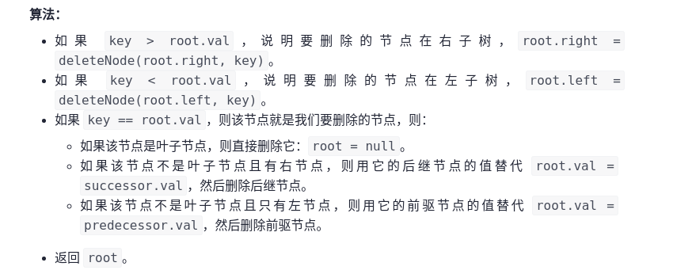

## 前言

题目：[450. 删除二叉搜索树中的节点](https://leetcode-cn.com/problems/delete-node-in-a-bst/)

参考题解：[删除二叉搜索树中的节点](https://leetcode-cn.com/problems/delete-node-in-a-bst/solution/shan-chu-er-cha-sou-suo-shu-zhong-de-jie-dian-by-l/)

---

## 提交代码

相对于[leetcode 701 二叉搜索树中的插入操作](https://blog.csdn.net/sinat_38816924/article/details/120429588)，删除二叉搜索树中的节点，要稍微麻烦些。

我直接看了答案分析，详细见参考题解。

 

```c++
class Solution {
public:
    TreeNode* deleteNode(TreeNode* root, int key) {
        if(root == nullptr)
            return nullptr;
        if(key < root->val)
            root->left = deleteNode(root->left,key);
        else if(key > root->val)
            root->right = deleteNode(root->right,key);
        else{
            if(root->left == nullptr && root->right == nullptr){ // 删除节点为叶子节点，直接删除
                delete root;
                root = nullptr;
            }else if(root->right != nullptr){ // 删除节点，存在右子树，用后继节点替代
                TreeNode* successor = root->right;
                while(successor->left != nullptr)
                    successor = successor->left;
                root->val = successor->val;
                root->right = deleteNode(root->right,successor->val);
            }else{ // 删除节点，仅存在左子树，用前驱节点代替
                TreeNode* predecessor = root->left;
                while(predecessor->right != nullptr)
                    predecessor = predecessor->right;
                root->val = predecessor->val;
                root->left = deleteNode(root->left,predecessor->val);
            }
        }
        return root;
    }
};
```

