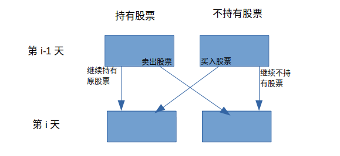

## 前言

题目：[122. 买卖股票的最佳时机 II](https://leetcode-cn.com/problems/best-time-to-buy-and-sell-stock-ii/)

参考题解：[买卖股票的最佳时机II-代码随想录](https://github.com/youngyangyang04/leetcode-master/blob/master/problems/0122.%E4%B9%B0%E5%8D%96%E8%82%A1%E7%A5%A8%E7%9A%84%E6%9C%80%E4%BD%B3%E6%97%B6%E6%9C%BAII%EF%BC%88%E5%8A%A8%E6%80%81%E8%A7%84%E5%88%92%EF%BC%89.md)

---

## 提交代码

之前，我们做过[leetcode 121 买卖股票的最佳时机](https://blog.csdn.net/sinat_38816924/article/details/120931323)。

之前，我们使用贪心的方式，做过本题[leetcode 122 买卖股票的最佳时机II](https://blog.csdn.net/sinat_38816924/article/details/120608920)

本次，我们使用动态规划来试试。动态规划最重要的是找见状态转移。它的转移方式如下：

 

代码实现如下：

```c++
class Solution {
public:
    int maxProfit(vector<int>& prices) {
        // 动态规划。第i天是否持有股票，受第i-1天的影响
        // 第i天持有股票所得的现金：dp[i][0] = max(dp[i-1][0],dp[i-1][1]-prices[i]); 前一天持有的股票，继续保持。前一天没有股票，买入
        // 第i天没有持有股票所得的最多现金：dp[i][1] = max(dp[i-1][1], dp[i-1][0]+prices[i]); 继续不持有股票。前一天的股票卖掉

        vector<vector<int>> dp(prices.size(),vector<int>(2,0));
        dp[0][0] = -prices[0];
        dp[0][1] = 0;

        for(int i=1; i<prices.size(); i++){
            dp[i][0] = max(dp[i-1][0],dp[i-1][1]-prices[i]);
            dp[i][1] = max(dp[i-1][1], dp[i-1][0]+prices[i]);
        }

        return dp[prices.size()-1][1];
    }
};
```

