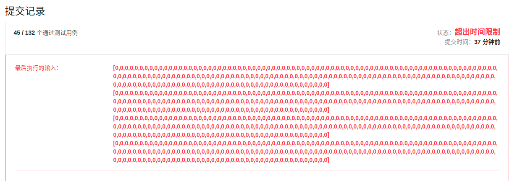

## 前言

题目：[454. 四数相加 II](https://leetcode-cn.com/problems/4sum-ii/)

参考答案：[454. 四数相加 II-力扣官方题解](https://leetcode-cn.com/problems/4sum-ii/solution/si-shu-xiang-jia-ii-by-leetcode-solution/)

---

## 提交代码

因为前面做过[leetcode 1 两数之和](https://blog.csdn.net/sinat_38816924/article/details/119982105)。所以，很自然想到，将四个数组分为两份。这样时间复杂度从$O(N^4)$下降到$O(N^2)$。

因为不同元素的求和，可能得到相同的结果。所以使用`unordered_multiset`存储。so easy，开干。分分钟，码出代码。(欲抑先扬)

```c++
#include <vector>
#include <unordered_set>
#include <iostream>

using namespace std;

class Solution {
public:
    int fourSumCount(vector<int>& nums1, vector<int>& nums2, vector<int>& nums3, vector<int>& nums4) {
        int result = 0;
        unordered_multiset<int> half; // 存储nums1+nums2的和
        unordered_multiset<int> otherHalf; // 存储nums3+nums4的和

        for(auto num1 : nums1){
            for(auto num2 : nums2)
                half.insert(num1+num2);
        }

        for(auto num3 : nums3){
            for(auto num4 : nums4)
                otherHalf.insert(num3+num4);
        }

        unordered_multiset<int>::iterator it;
        for(it=half.begin(); it!=half.end(); it++){
            // cout<<result<<endl;
            result += otherHalf.count(-(*it));
        }

        return result;
    }
};

int main(void){
    vector<int> nums1={0,0,0,0,0,0,0,0,0,0,0,0,0,0,0,0,0,0,0,0,0,0,0,0,0,0,0,0,0,0,0,0,0,0,0,0,0,0,0,0,0,0,0,0,0,0,0,0,0,0,0,0,0,0,0,0,0,0,0,0,0,0,0,0,0,0,0,0,0,0,0,0,0,0,0,0,0,0,0,0,0,0,0,0,0,0,0,0,0,0,0,0,0,0,0,0,0,0,0,0,0,0,0,0,0,0,0,0,0,0,0,0,0,0,0,0,0,0,0,0,0,0,0,0,0,0,0,0,0,0,0,0,0,0,0,0,0,0,0,0,0,0,0,0,0,0,0,0,0,0,0,0,0,0,0,0,0,0,0,0,0,0,0,0,0,0,0,0,0,0,0,0,0,0,0,0,0,0,0,0,0,0,0,0,0,0,0,0,0,0,0,0,0,0,0,0,0,0,0,0}; 
    vector<int> nums2={0,0,0,0,0,0,0,0,0,0,0,0,0,0,0,0,0,0,0,0,0,0,0,0,0,0,0,0,0,0,0,0,0,0,0,0,0,0,0,0,0,0,0,0,0,0,0,0,0,0,0,0,0,0,0,0,0,0,0,0,0,0,0,0,0,0,0,0,0,0,0,0,0,0,0,0,0,0,0,0,0,0,0,0,0,0,0,0,0,0,0,0,0,0,0,0,0,0,0,0,0,0,0,0,0,0,0,0,0,0,0,0,0,0,0,0,0,0,0,0,0,0,0,0,0,0,0,0,0,0,0,0,0,0,0,0,0,0,0,0,0,0,0,0,0,0,0,0,0,0,0,0,0,0,0,0,0,0,0,0,0,0,0,0,0,0,0,0,0,0,0,0,0,0,0,0,0,0,0,0,0,0,0,0,0,0,0,0,0,0,0,0,0,0,0,0,0,0,0,0}; 
    vector<int> nums3={0,0,0,0,0,0,0,0,0,0,0,0,0,0,0,0,0,0,0,0,0,0,0,0,0,0,0,0,0,0,0,0,0,0,0,0,0,0,0,0,0,0,0,0,0,0,0,0,0,0,0,0,0,0,0,0,0,0,0,0,0,0,0,0,0,0,0,0,0,0,0,0,0,0,0,0,0,0,0,0,0,0,0,0,0,0,0,0,0,0,0,0,0,0,0,0,0,0,0,0,0,0,0,0,0,0,0,0,0,0,0,0,0,0,0,0,0,0,0,0,0,0,0,0,0,0,0,0,0,0,0,0,0,0,0,0,0,0,0,0,0,0,0,0,0,0,0,0,0,0,0,0,0,0,0,0,0,0,0,0,0,0,0,0,0,0,0,0,0,0,0,0,0,0,0,0,0,0,0,0,0,0,0,0,0,0,0,0,0,0,0,0,0,0,0,0,0,0,0,0}; 
    vector<int> nums4={0,0,0,0,0,0,0,0,0,0,0,0,0,0,0,0,0,0,0,0,0,0,0,0,0,0,0,0,0,0,0,0,0,0,0,0,0,0,0,0,0,0,0,0,0,0,0,0,0,0,0,0,0,0,0,0,0,0,0,0,0,0,0,0,0,0,0,0,0,0,0,0,0,0,0,0,0,0,0,0,0,0,0,0,0,0,0,0,0,0,0,0,0,0,0,0,0,0,0,0,0,0,0,0,0,0,0,0,0,0,0,0,0,0,0,0,0,0,0,0,0,0,0,0,0,0,0,0,0,0,0,0,0,0,0,0,0,0,0,0,0,0,0,0,0,0,0,0,0,0,0,0,0,0,0,0,0,0,0,0,0,0,0,0,0,0,0,0,0,0,0,0,0,0,0,0,0,0,0,0,0,0,0,0,0,0,0,0,0,0,0,0,0,0,0,0,0,0,0,0};
    // cout<<nums1.size()<<endl;
    Solution s;
    cout<<s.fourSumCount(nums1,nums2,nums3,nums4);
}
```

 

可恶这个代码超时了。我调试了下代码，并非出现死循环导致超时，是扎扎实实的代码运行过程超时。超时在[count](https://zh.cppreference.com/w/cpp/container/unordered_multiset/count)这个函数。`count`的复杂度，平均与拥有关键 `key` 的元素数成线性，最坏情况与容器大小成线性。这里碰上了最坏情况。`count`那个代码段需要运行$200*200*200*200=1600000000$次。

问题在于，我为了使相同的和有所区分，使用了`unordered_multiset`作为存储结构。参考下答案，不去区分相同的和，转而对相同的和进行次数累加，便可避免上面的情况。参考答案后，代码修改如下。（边读数据边处理）

```c++
class Solution {
public:
    int fourSumCount(vector<int>& nums1, vector<int>& nums2, vector<int>& nums3, vector<int>& nums4) {
        int result = 0;
        unordered_map<int,int> half; // 存储nums1+nums2的和

        for(auto num1 : nums1){
            for(auto num2 : nums2)
                half[num1+num2]++;
        }

        for(auto num3 : nums3){
            for(auto num4 : nums4)
                if(half.count(-num3-num4))
                    result += half[-num3-num4];
        }

        return result;
    }
};
```


