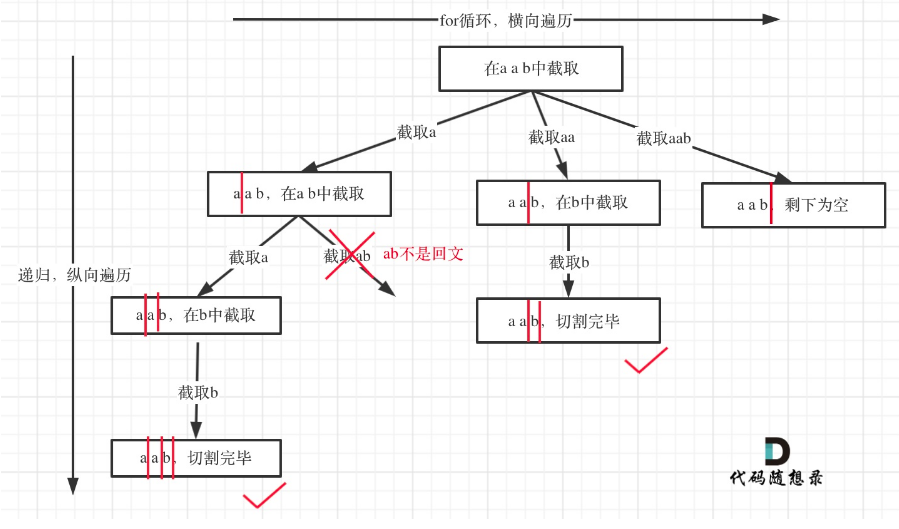

## 前言

题目：[131. 分割回文串](https://leetcode-cn.com/problems/palindrome-partitioning/)

参考题解：[分割回文串-代码随想录](https://github.com/youngyangyang04/leetcode-master/blob/master/problems/0131.%E5%88%86%E5%89%B2%E5%9B%9E%E6%96%87%E4%B8%B2.md)

## 提交代码

### 先切割再判断

方法一：思考了下，这道题目的思路为，“切几刀”+“这几刀切在什么位置”

* 切n刀：n可以切0，1，……，s.size()-1刀。
* 从s.size()-1个位置中，跳出n个位置被切。(回溯)
* 切完判断，分割的子串是否均为回文串。

思路比较简单，代码实现起来，略微复杂点。

```c++
#include <string>
#include <vector>
#include <iostream>

using namespace std;

class Solution {
private:
    vector<vector<string>> result;
public:
    bool is_palindrome(const string& s, int left, int right){
        // 判断闭区间s[left,right]是否为回文字符串
        bool flag = true;
        while(left <= right){
            if(s[left]!=s[right]){
                flag = false;
                break;
            }
            left++;
            right--;
        }
        return flag;
    }


    bool Palindrome_Partitioning(const string& s, vector<int>& cut_locs,vector<vector<string>>& result){
        // 传入切割位置cut_locs
        // 判断切割之后，是否均为回文串
        // 均为回文串，将结果放入result中，返回true；存在一个不为均为回文串，直接返回false；
        vector<string> palindrome;

        int left=0, right; // left=0,切在整个字符串最前面
        for(int i=0; i<=cut_locs.size(); i++){
            if(i == cut_locs.size()) // 切在字符串最后面
                right = s.size()-1;
            else
                right = cut_locs[i];
            if(!is_palindrome(s,left,right))
                return false;
            palindrome.push_back(string(s.begin()+left,s.begin()+right+1)); 
            left = right+1;
        }
        result.push_back(palindrome);
        return true;
    }

    void backTracking_cutlocs(const string& s, int cut_nums, vector<int>& cut, vector<vector<int>>& cuts, int startIndex=0){
        // 在字符串s中，切cut_nums次 == 从s.size()-1个位置中，选择cut_nums个
        // 将组合放入cuts
        if(cut_nums == 0) // 切0刀，直接返回
            return;
        if(cut.size() == cut_nums){
            cuts.push_back(cut);
            return;
        }
        for(int i=startIndex; i<=s.size()-1-1; i++){
            cut.push_back(i);
            backTracking_cutlocs(s,cut_nums,cut,cuts,i+1);
            cut.pop_back();
        }
    }


    vector<vector<string>> partition(string s) {
        for(int i=0; i<s.size(); i++){ // 不断添加切割次数
            vector<int> cut;
            vector<vector<int>> cuts;
            backTracking_cutlocs(s,i,cut,cuts); // 将切割i次的切割位置组合放入cuts中
            
            if(i==0)
                Palindrome_Partitioning(s,cut,result); // 没有切割，传入一个空数组
            else
                for(auto cut : cuts)
                    Palindrome_Partitioning(s,cut,result); // 传入切割位置。如果切割后全部子串为回文串，将该切割组合对应的全部子串，放入result中
            
        }
        return result;
    }
};

int main(void){

    // // 测试Palindrome_Partitioning函数
    // string s = "a";
    // vector<int> cut_locs = {};
    // vector<vector<string>> result;
    // Solution sol;
    // sol.Palindrome_Partitioning(s,cut_locs,result);
    // for(auto pal : result){
    //     for(auto str : pal)
    //         cout<<str<<" ";
    //     cout<<endl;
    // }

    string s = "a";
    Solution sol;
    vector<vector<string>> result = sol.partition(s);
    for(auto pal : result){
        for(auto str : pal)
            cout<<str<<" ";
        cout<<endl;
    }
}
```

### 边切割边判断

**下面思路和代码来自参考题解**。

方法二：

1. 每次切割的时候，都保证当前被切出来的部分为回文串。
2. 横向上，在满足1时，不断切的更多。
3. 在纵向上，切割剩余剩余子串。

PS：注意下面的代码有两个递归出口。其一为if出口(尾部是回文串)；其二为continue导致循环结束的出口(尾部不是回文串)。

方法二比方法一效率高。但是方法二的思维量也远大于方法一。



```c++
class Solution {
private:
    vector<vector<string>> result;
    vector<string> path; // 放已经回文的子串
    void backtracking (const string& s, int startIndex) {
        // 如果起始位置已经大于s的大小，说明已经找到了一组分割方案了
        if (startIndex >= s.size()) {
            result.push_back(path);
            return;
        }
        for (int i = startIndex; i < s.size(); i++) {
            if (isPalindrome(s, startIndex, i)) {   // 是回文子串
                // 获取[startIndex,i]在s中的子串
                string str = s.substr(startIndex, i - startIndex + 1);
                path.push_back(str);
            } else {                                // 不是回文，跳过
                continue;
            }
            backtracking(s, i + 1); // 寻找i+1为起始位置的子串
            path.pop_back(); // 回溯过程，弹出本次已经填在的子串
        }
    }
    bool isPalindrome(const string& s, int start, int end) {
        for (int i = start, j = end; i < j; i++, j--) {
            if (s[i] != s[j]) {
                return false;
            }
        }
        return true;
    }
public:
    vector<vector<string>> partition(string s) {
        result.clear();
        path.clear();
        backtracking(s, 0);
        return result;
    }
};
```

