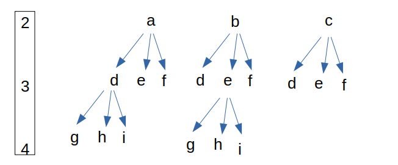

## 前言

题目：[17. 电话号码的字母组合](https://leetcode-cn.com/problems/letter-combinations-of-a-phone-number/)

参考题解：[电话号码的字母组合-代码随想录](https://github.com/youngyangyang04/leetcode-master/blob/master/problems/0017.%E7%94%B5%E8%AF%9D%E5%8F%B7%E7%A0%81%E7%9A%84%E5%AD%97%E6%AF%8D%E7%BB%84%E5%90%88.md)

---

## 提交代码

最重要的是，先把组合的树状图画出来。

 

思路：for循环控制横向扩展+递归控制纵向扩展+递归行前进行数据处理，递归行后消除之前的影响。

和[leetcode 77 组合](https://blog.csdn.net/sinat_38816924/article/details/120442835)、[leetcode 216 组合总和III](https://blog.csdn.net/sinat_38816924/article/details/120461210)处理类似。

```c++
class Solution {
private:
    map<char,vector<char>> rule{
        {'2',{'a','b','c'}},
        {'3',{'d','e','f'}},
        {'4',{'g','h','i'}},
        {'5',{'j','k','l'}},
        {'6',{'m','n','o'}},
        {'7',{'p','q','r','s'}},
        {'8',{'t','u','v'}},
        {'9',{'w','x','y','z'}}
    };

    vector<string> result;
    string s;
    void backTracking(const string& digits, int index){
        // 递归出口
        if(index == digits.size()){
            result.push_back(s);
            return;
        }

        vector<char>& digit_letters = rule[digits[index]];
        for(int i=0; i<digit_letters.size(); i++){ // 横向扩展
            s.push_back(digit_letters[i]);
            backTracking(digits,index+1); // 纵向扩展
            s.pop_back();
        }
    }

public:
    vector<string> letterCombinations(string digits) {
        if(digits.empty())
            return {};
        backTracking(digits,0);
        return result;
    }
};
```

