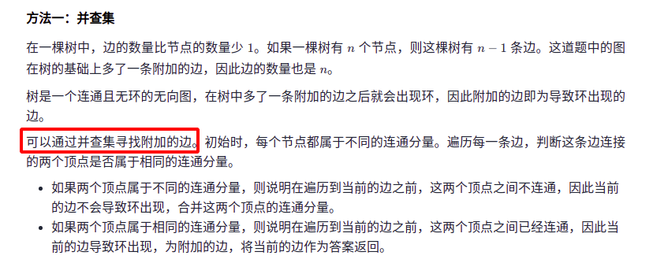

## 前言

题目：[684. 冗余连接](https://leetcode-cn.com/problems/redundant-connection/)

参考题解：[冗余连接-力扣官方题解](https://leetcode-cn.com/problems/redundant-connection/solution/rong-yu-lian-jie-by-leetcode-solution-pks2/)

并查集视频介绍：[【算法】并查集（Disjoint Set）[共3讲]](https://www.bilibili.com/video/BV13t411v7Fs?p=3)

---

## 提交代码

下面思路截图来自上面参考题解。

 


```C++
class Solution {
public:
    void initialize(const vector<vector<int>>& edges, vector<int>& parents){
        // 初始每个节点为一个连通分量。父节点为自己
        int n = edges.size();
        for(int i=1; i<=n; i++)
            parents[i] = i;
        return;
    }

    int findRoot(int node, vector<int>& parents){
        // 返回根节点所在连通分量的根节点
        while(parents[node] != node)
            node = parents[node];
        return node;
    }

    void unionSet(int node1, int node2, vector<int>& parents){
        // 当两个节点不在同一个连通分量的时候，合并两个连通分量
        int root1 = findRoot(node1, parents);
        int root2 = findRoot(node2, parents);
        parents[root1] = root2;
        return;
    }

    vector<int> findRedundantConnection(vector<vector<int>>& edges) {
        // 使用并查集检查图是否存在环
        int n = edges.size();
        vector<int> parents(n+1);
        initialize(edges,parents);

        for(auto edge : edges){
            int node1 = edge[0];
            int node2 = edge[1];
            if(findRoot(node1,parents) != findRoot(node2,parents)){
                unionSet(node1,node2,parents);
            }else{
                return edge; // 两个点在通过一个连通分量里面。再加一条边，必然出现环
            }
        }

        return {};
    }
};
```