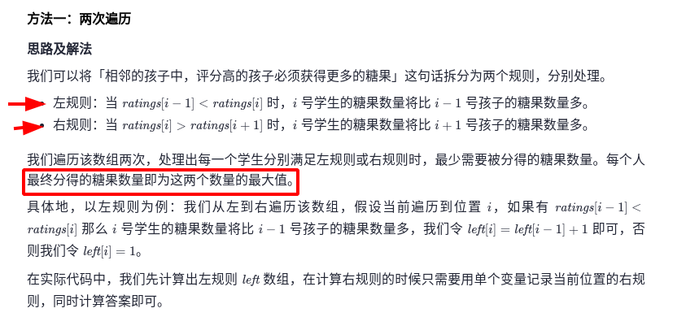

## 前言

题目：[135. 分发糖果](https://leetcode-cn.com/problems/candy/)

参考题解：[分发糖果-力扣官方题解](https://leetcode-cn.com/problems/candy/solution/fen-fa-tang-guo-by-leetcode-solution-f01p/)

---

## 提交代码

我没想出来，看了答案，大致明白思路。

 

我解释下，为什么，取最大值，可以同时满足左规则和右规则。

对于序列`ratings = [1,3,5,2,3,3]`。它满足左规则的糖果序列为`[1,2,3,1,2,1]`。它满足右规则的糖果序列为`[1,1,2,1,1,1]`。它满足左右规则的糖果序列为两者取较大值`[1,2,3,1,2,1]`。对于`ratings[1]`来说，满足左规则的值为2，满足右规则的值为1。取较大值2，它在满足左规则的同时，因为较大，必然也满足右规则。对每个元素，都需要如此处理，以避免对单个元素调整，破坏左右关系。

```c++
class Solution {
public:
    int candy(vector<int>& ratings) {
        const int size = ratings.size();
        vector<int> left(size,0);
        vector<int> right(size,0);
        int result = 0;

        for(int i=0; i<size; i++){ // 从左向右，满足规则
            if(i>0 && ratings[i]>ratings[i-1])
                left[i] = left[i-1] + 1;
            else
                left[i] = 1;
        }

        for(int i=size-1; i>=0; i--){ // 从右向左，满足规则
            if(i<size-1 && ratings[i]>ratings[i+1])
                right[i] = right[i+1] + 1;
            else
                right[i] = 1;
        }

        for(int i=0; i<size; i++){
            result += max(left[i], right[i]); // 同时满足从左向右，从右向左规则
        }

        return result;
    }
};
```

