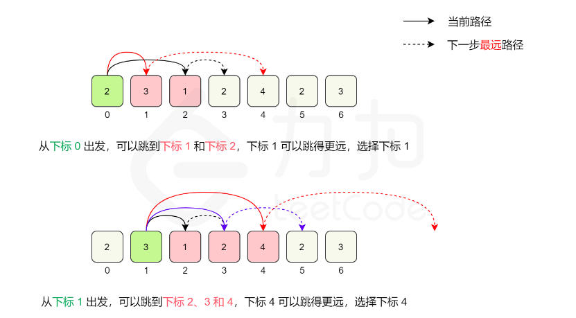

## 前言

题目：[45.跳跃游戏II](https://leetcode-cn.com/problems/jump-game-ii/)

参考题解：[跳跃游戏II-力扣官方题解](https://leetcode-cn.com/problems/jump-game-ii/solution/tiao-yue-you-xi-ii-by-leetcode-solution/)

---

## 提交代码

如果之前做过[leetcode 55 跳跃游戏](https://blog.csdn.net/sinat_38816924/article/details/120626239),那么“跳跃游戏II”应该不难。

核心思想：在当前范围[s1,e1]内，选择下一个跳转范围[s2,e2]。其中s2=e1+1，e2等于[s1,e1]中元素可以跳转最远的点。



```c++
class Solution {
public:
    int jump(vector<int>& nums) {
        if(nums.size() == 1) // 只有一个元素，不用前进，到达重点
            return 0;
        
        int start = 0;
        int end = start + nums[start];
        int farthest_loc = end;
        int count = 1;
        if(farthest_loc >= nums.size()-1) // 终点在一级火箭的打击范围内
            return count;
        
        while(1){ // 题目限定：总是可以到达数组的最后一个位置
            count++; // 每进入一次循环，代表着使用新的打击范围
            for(int i=start+1; i<=end; i++){ // 下一级火箭，所能打击的最大范围
                farthest_loc = max(farthest_loc,nums[i]+i);
                if(farthest_loc >= nums.size()-1)
                    return count;
            }
            start = end;
            end = farthest_loc;
        }
    }
};
```

